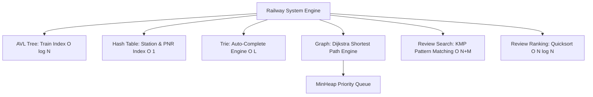

# Railway Planner & Enquiry Portal

A high-performance C++ Railway Enquiry System, Route Planner, and Review Management Portal built from scratch using foundational Data Structures and Algorithms: **AVL Trees**, **Hash Tables**, **Min-Heaps**, **Tries**, **Weighted Graphs (Dijkstra's Algorithm)**, **KMP String Matching**, and **Quicksort**.

---

## 🌟 Features & Data Structure Architecture



### 1. 🚆 Train Enquiry & Balanced Indexing (AVL Tree)
- **Data Structure**: Self-Balancing `AVLTree<int, Train>`
- **Time Complexity**: $O(\log N)$ for Insertion, Search, Deletion, and Range Queries.
- Operates rotations (Left, Right, Left-Right, Right-Left) to maintain height balance $H \le 1.44 \log_2 N$.
- Enables fast logarithmic lookups for train numbers and schedule queries.

### 2. 🏢 Station & Ticket Booking Lookup (Hash Table)
- **Data Structure**: Templated `HashTable<K, V>` with Separate Chaining.
- **Hash Function**: Custom Polynomial Rolling Hash ($p=31, m=10^9+7$).
- **Time Complexity**: Average $O(1)$ for lookup, insertion, and deletion. Dynamic rehashing when load factor exceeds $\alpha = 0.75$.
- Used for mapping station codes (e.g., `CSMT`, `NDLS`, `HWH`) to Station metadata and instant 10-digit PNR ticket status lookups.

### 3. 🗺️ Route Finder & Multi-Criteria Pathfinding (Graph & MinHeap)
- **Data Structure**: Weighted Directed `Graph` with Adjacency List + Custom `MinHeap` Priority Queue.
- **Algorithms**:
  - **Dijkstra's Algorithm**: $O((V + E) \log V)$ computation for shortest distance (km), fastest duration (time), or minimum fare (INR).
  - **1-Transfer Connecting Routes**: Computes alternative multi-leg itineraries with transfer layover validation.

### 4. 🔍 Review Management & Search (Trie, KMP, Quicksort)
- **Trie (Prefix Tree)**: Fast auto-complete keyword suggestions ($O(L)$ where $L$ is prefix length).
- **KMP (Knuth-Morris-Pratt)**: $O(N + M)$ exact pattern matching algorithm computing Longest Prefix Suffix (LPS) array for substring searching in user reviews.
- **Quicksort**: $O(N \log N)$ custom sorting algorithm with median-of-three pivot selection for sorting reviews by rating, date, or ID.

---

## 📊 Data Structure Complexity Reference

| Data Structure / Algorithm | Operations / Use Case | Time Complexity (Best / Avg) | Time Complexity (Worst) | Space Complexity |
| :--- | :--- | :--- | :--- | :--- |
| **AVL Tree** | Search, Insert, Delete Train | $O(\log N)$ | $O(\log N)$ | $O(N)$ |
| **Hash Table** | Station Code & PNR Lookup | $O(1)$ | $O(N)$ *(Rehash amortized $O(1)$)* | $O(N)$ |
| **Min-Heap** | Priority Queue in Dijkstra | $O(1)$ top, $O(\log V)$ pop/push | $O(\log V)$ | $O(V)$ |
| **Trie** | Auto-Complete Suggestions | $O(L)$ | $O(L)$ | $O(\Sigma \cdot N \cdot L)$ |
| **KMP Search** | Keyword Search in Reviews | $O(N + M)$ | $O(N + M)$ | $O(M)$ |
| **Quicksort** | Review & Train Sorting | $O(N \log N)$ | $O(N \log N)$ *(Median-3)* | $O(\log N)$ |
| **Graph Dijkstra**| Route Finding | $O((V + E) \log V)$ | $O((V + E) \log V)$ | $O(V + E)$ |

---

## 🛠️ Project Structure

```
Railway_planner/
├── CMakeLists.txt              # CMake build configuration
├── Makefile                    # GNU Makefile
├── README.md                   # Comprehensive documentation
├── data/                       # CSV dataset files
│   ├── stations.csv
│   ├── trains.csv
│   └── reviews.csv
├── include/
│   ├── ds/                     # Header-only custom Data Structures
│   │   ├── AVLTree.hpp
│   │   ├── HashTable.hpp
│   │   ├── MinHeap.hpp
│   │   └── Trie.hpp
│   ├── algo/                   # Header-only Custom Algorithms
│   │   ├── KMP.hpp
│   │   └── Quicksort.hpp
│   ├── models/                 # Domain Object Models
│   │   ├── Station.hpp
│   │   ├── Train.hpp
│   │   ├── Review.hpp
│   │   └── Ticket.hpp
│   └── core/                   # Core Graph & Portal Engine
│       ├── Graph.hpp
│       └── RailwaySystem.hpp
├── src/
│   ├── core/
│   │   └── RailwaySystem.cpp   # Core Engine Logic
│   └── main.cpp                # Interactive Terminal CLI Portal
└── tests/
    └── test_main.cpp           # Custom Unit Test Suite
```

---

## 🚀 Building & Running

### Requirements
- GCC / G++ (C++17 support or newer)
- GNU Make or CMake (v3.16+)

### Quick Build with Makefile

```bash
# Compile both application and tests
make

# Run the unit test suite
make test

# Launch the interactive Railway Planner Portal
make run
```

### Build with CMake

```bash
cmake -B build
cmake --build build

# Run unit test binary
./build/run_tests

# Run application binary
./build/railway_planner
```

---

## 💻 Sample CLI Usage

```text
========================================================================
             RAILWAY PLANNER & ENQUIRY PORTAL              
  (AVL Tree | Hash Table | MinHeap | Trie | Dijkstra | KMP | Quicksort) 
========================================================================

MAIN PORTAL MENU:
 [1] Route Planner & Train Search (Dijkstra Shortest Path)
 [2] Station & Train Schedule Enquiry (AVL & Hash Table Lookup)
 [3] Review Portal (Trie Auto-Complete, KMP Search, Quicksort Ranking)
 [4] Ticket Booking & PNR Status Inquiry
 [5] DSA Performance & Benchmark Inspector
 [6] Exit Application
```

---

## 🧪 Testing & Verification

The unit test suite (`tests/test_main.cpp`) rigorously verifies correctness and edge cases for every data structure and algorithm:
- **AVL Tree**: Verifies balance factors, single/double rotations, range queries.
- **Hash Table**: Tests load factor trigger, rehash, collision chaining.
- **MinHeap**: Verifies priority ordering and binary tree properties.
- **Trie**: Validates prefix matching and top suggestion frequencies.
- **KMP**: Tests LPS table calculation, pattern matching accuracy, and case sensitivity.
- **Quicksort**: Tests array sorting with median-of-three pivot selection.
- **Graph Dijkstra**: Tests shortest path routing on sample vertices and edge weights.

---

## 📜 License
Open Source — Released under the MIT License.
